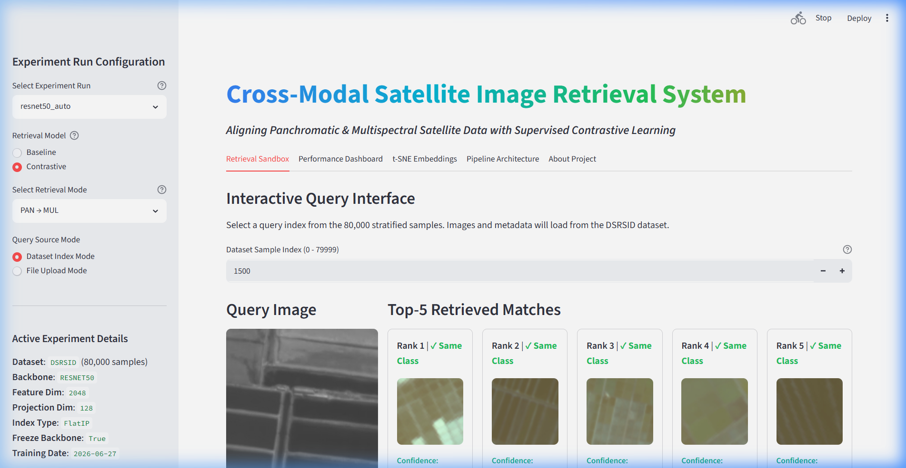
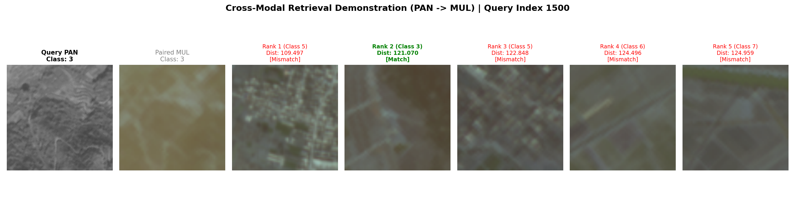
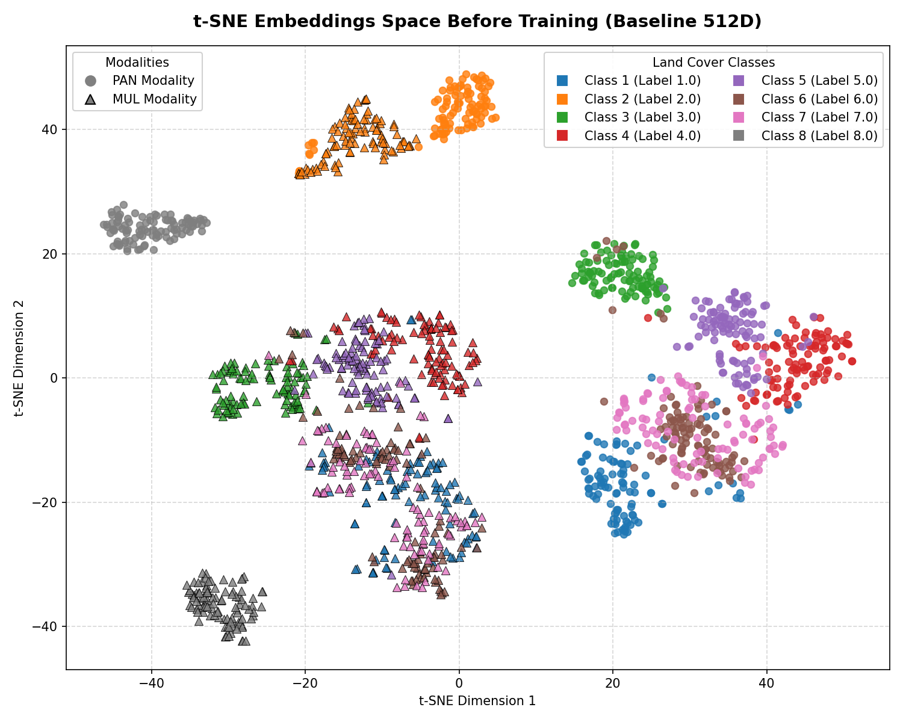
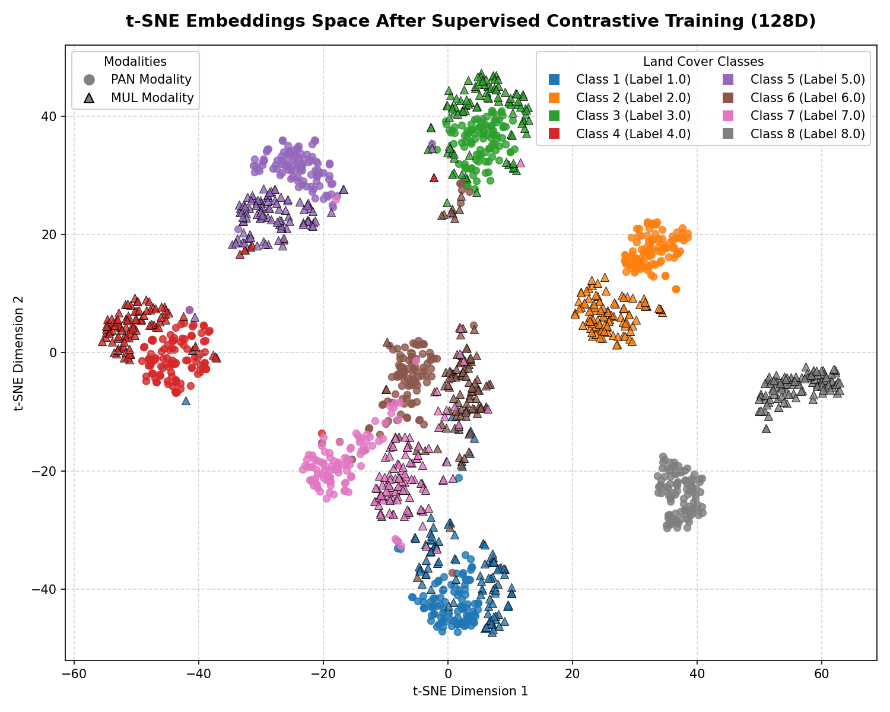

# Cross-Modal Satellite Image Retrieval System

A deep learning framework for cross-modal retrieval of dual-spectral satellite images. The system projects heterogeneous Panchromatic (PAN) and Multispectral (MUL) image pairs from the Deep Satellite Remote Sensing Image Dataset (DSRSID) into a unified, shared embedding space using supervised contrastive learning. Users can query images in one modality to retrieve corresponding images from the other modality.

---

## Quick Start (Copy & Paste)

Get the project running instantly by copying and running the following commands:

```bash
# 1. Clone or navigate to the repository
cd ISRO_Hackathon

# 2. Set up and activate virtual environment
python -m venv sat_env
sat_env\Scripts\activate      # On Windows
source sat_env/bin/activate   # On Linux/macOS

# 3. Install dependencies
pip install -r requirements.txt

# 4. Place DSRSID.mat in data/
# Make sure DSRSID.mat is located at ISRO_Hackathon/data/DSRSID.mat

# 5. Run the entire pipeline end-to-end (takes a few minutes)
python pipeline.py --all

# 6. Launch the interactive dashboard
streamlit run app.py
```

---

## Pipeline Flow

```
     [ DSRSID.mat Dataset ]
               │
               ▼
  Baseline Embedding Extraction (extract_embeddings.py)
               │
               ▼
  Supervised Contrastive Training (train_contrastive.py)
               │
               ▼
  Shared Embedding Generation (evaluate_contrastive.py)
               │
               ▼
     FAISS Index Creation (build_faiss.py)
               │
               ▼
  Evaluation & Visualizations (retrieve.py / precompute_metrics.py)
               │
               ▼
     [ Interactive Streamlit Dashboard (app.py) ]
```

---

## Hardware & System Requirements

*   **Operating System**: Windows 10/11, Ubuntu 20.04+, macOS
*   **Python Version**: Python 3.9 to 3.11
*   **RAM**: 8 GB minimum (16 GB recommended)
*   **Storage**: 5 GB available disk space (for dataset, checkpoints, and index files)
*   **Processor**: CPU supported (GPU/CUDA support is optional and will be auto-detected to speed up model training)

---

## Project Structure

```
ISRO_Hackathon/
│
├── app.py                     # Streamlit interactive dashboard web app
├── pipeline.py                # Automated pipeline orchestrator (CLI)
├── config.py                  # Shared project configuration and hyper-parameters
├── dataset.py                 # Lazy-loading PyTorch Dataset handler for HDF5 (.mat)
├── train_contrastive.py       # Supervised contrastive training routine
├── evaluate_contrastive.py    # Metric evaluations and contrastive embedding extraction
├── retrieve.py                # FAISS query retrieval execution and metric computing
├── build_faiss.py             # Generates similarity search indices
├── precompute_metrics.py      # Baseline vs Contrastive metric computation script
├── visualize_embeddings.py    # Generates t-SNE embedding visualizations
├── requirements.txt           # Python dependency checklist
├── README.md                  # System instruction and documentation manual
│
├── data/                      # Dataset repository (Place DSRSID.mat here)
│     └── DSRSID.mat
│
├── models/                    # Holds trained PyTorch model binaries (.pth)
├── embeddings/                # Extracted PAN/MUL feature vectors (.npy)
├── faiss_indices/             # Generated FAISS binary index files (.bin)
├── outputs/                   # Plot figures, graphs, and visualizations (.png)
├── checkpoints/               # Intermediate training weights / resumption files
└── logs/                      # Training history logs and metrics summaries (.json, .csv)
```

---

## Expected Outputs

After executing the pipeline command (`python pipeline.py --all`), the following artifacts will be generated in their respective directories:

*   `models/best_model.pth`: Trained contrastive model checkpoint.
*   `embeddings/pan_embeddings_contrastive.npy` & `mul_embeddings_contrastive.npy`: Extracted fine-tuned cross-modal embeddings.
*   `faiss_indices/pan_index_contrastive.bin` & `mul_index_contrastive.bin`: Built FAISS search indices for sub-millisecond query execution.
*   `logs/metrics_summary_contrastive.json`: Calculated retrieval performance summary (Recall@K, mAP, etc.).
*   `outputs/embeddings_tsne_after.png`: t-SNE projection of the embedding space showing post-training alignment.
*   `outputs/retrieval_results.png`: Sample query retrieval visualization panel.

---

## Dashboard Features

The Streamlit web interface (`app.py`) offers the following functionalities:

*   **Interactive Modality Querying**: Query using a PAN image to retrieve corresponding MUL images, or vice versa.
*   **Top-K Results Viewer**: View query images alongside the top nearest-neighbor match results with distance scores.
*   **Mode Comparison**: Switch between Baseline (pre-trained ResNet) and Contrastive (fine-tuned) models to compare search performance.
*   **Metric Visualization**: View precision, recall, and mean Average Precision (mAP) reports.
*   **t-SNE Embeddings View**: Visualize alignment of high-dimensional embeddings before and after contrastive learning.
*   **Trigger Pipeline Stages**: Run pipeline steps (extraction, training, index generation) dynamically from the sidebar.

---

## Visualizations & Outputs

### 1. Interactive Web Dashboard (Streamlit)


### 2. Cross-Modal Retrieval Results


### 3. Embedding Space Alignment (t-SNE before vs. after Contrastive Learning)
| Before Contrastive Training (Baseline) | After Contrastive Training (Aligned) |
|:---:|:---:|
|  |  |

---

## Troubleshooting

*   **Problem: `DSRSID.mat not found`**
    *   *Solution*: Make sure `DSRSID.mat` is downloaded and placed under the `data/` or `dataset/` directory.

*   **Problem: `FAISS import error`**
    *   *Solution*: Install the FAISS CPU package using `pip install faiss-cpu`. (On Windows, ensure you have C++ Build Tools installed).

*   **Problem: `CUDA not detected`**
    *   *Solution*: The framework runs on CPU by default. No GPU is required, though model training will automatically utilize CUDA if present.

---

## Dataset Credits

*   **Dataset Name**: Deep Satellite Remote Sensing Image Dataset (DSRSID)
*   **Modality Pairs**: Co-registered Panchromatic (PAN) and Multispectral (MUL) satellite image pairs.
*   **Categories**: 8 distinctive land cover classes.
